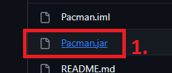
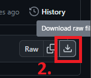
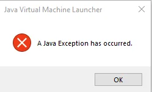

# Pacman

---

Ez a *Programozás Alapjai 3* tárgyhoz készített házi feladatom.

[Pacman és szellem grafikák forrása](https://www.spriters-resource.com/arcade/pacman/sheet/52631/)

[Használt betűtípus forrása](https://www.dafont.com/dogica.font)

---

## A játék indítása

1. Töltsd le és telepítsd a Java-t [innen](https://www.java.com/download/ie_manual.jsp)

2. Töltsd le a játékot
   - elég a *Pacman.jar* file-t letöltened, ehhez kattints a file-ra, majd jobb oldalt a letöltés gombra
   
   

   

   - letöltheted az egész kódot is, ezt a fenti *Code* gombra, majd a *Download ZIP* gombra kattintva teheted meg
   
   

3. A játék indításához kattints kétszer a letöltött *Pacman.jar* file-ra

> Előfordulhat, hogy a játék nem indul el, és a következő hibát jelzi:
> 
> 
> 
> Ekkor a következőt kell tenned:
> 
> 1. Töltsd le [ezt](https://johann.loefflmann.net/downloads/jarfix.exe) a programot
> 2. Nyomd meg a Windows gombot a billentyűzeten és írd be, hogy `cmd`, majd nyomd meg az Entert
> 3. Feltéve, hogy a *Letöltések* mappában van az előbb letöltött program, írd be a parancssorba ezt a két parancsot (két külön sorba):
> 
>     `cd Downloads`
> 
>     `jarfix.exe /64`
> 
> Ezek után már remélhetőleg el fog indulni a játék
