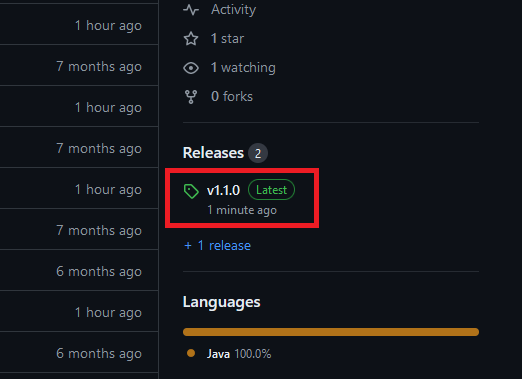

# Pacman

---

Ez a *Programozás Alapjai 3* tárgyhoz készített házi feladatom.

[Pacman és szellem grafikák forrása](https://www.spriters-resource.com/arcade/pacman/sheet/52631/)

[Használt betűtípus forrása](https://www.dafont.com/dogica.font)

[Gson Library forrása](https://github.com/google/gson)

---

## A játék indítása

1. Töltsd le és telepítsd a Java installert [innen](https://www.oracle.com/java/technologies/downloads/#jdk22-windows)

2. Töltsd le a játék legfrissebb verzióját

   - kattints a jobb oldali *Releases* alatt található *Latest* taggel ellátott verzióra 
   
   

   - ezen az oldalon válaszd a lista tetején lévő *zip* fájlt
   
   

4. A letöltött fájlt kicsomagolva a játék mappáját kapjuk. Ebben a mappában található pl. a `config.json`, amit megnyitva (Jobbklikk -> Open with... -> Notepad) fontos dolgokat tudunk beállítani.

   

   - a playerName után lévő macskakörmök közé beírhatod a neved, bár ezt a játék az első indításnál meg is kérdezi
   - a serverAddress után a játékhoz tartozó szerver IP-címét kell beírni, ezt tőlem tudhatod meg dm-ben (ha üresen hagyod akkor a leaderboard nem lesz szinkronizálva, de a játék így is működni fog)
   - a scale a játék nagyítását adja meg (továbbra sem lehet a klasszikus módon nagyítani a játékot, de azért ez is valami)

5. A játék indításához kattints kétszer a letöltött *Pacman.jar* file-ra. Ha a Windows rákérdez, akkor érdemes átengedni a tűzfalon a játékot, hogy elérd a szervert.

> Előfordulhat, hogy a játék nem indul el, és a következő hibát jelzi:
> 
> 
> 
> Ekkor a következőt kell tenned:
> 
> 1. Töltsd le [ezt](https://johann.loefflmann.net/downloads/jarfix.exe) a programot
> 2. Nyomd meg a Windows gombot a billentyűzeten, írd be, hogy `cmd`, majd nyomd meg az Entert
> 3. Feltéve, hogy a *Letöltések* mappában van az előbb letöltött program, írd be a parancssorba ezt a két parancsot (két külön sorba):
> 
>     `cd Downloads`
> 
>     `jarfix.exe /64`
> 
> Ezek után már remélhetőleg el fog indulni a játék
